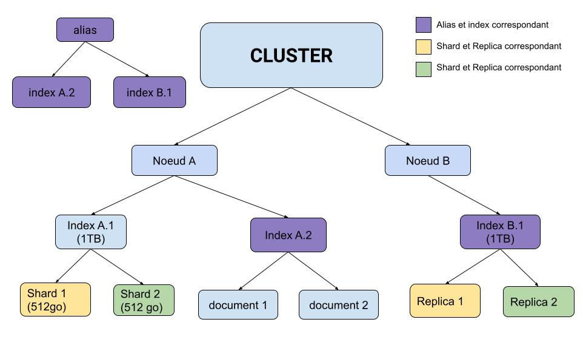

# Elasticsearch

# Etape d'installation Elasticsearch avec Docker : 
 téléchargement de l'image docker :

 - docker pull docker.elastic.co/elasticsearch/elasticsearch:8.7.1

Création d'un docker network pour elasticsearch et kibana :

 - docker network create elastic 

Démarrer Elasticsearch : 

- docker run --name elasticsearch --net elastic -p 9200:9200 -p 9300:9300 -e "discovery.type=single-node" -t docker.elastic.co/elasticsearch/elasticsearch:8.7.1
  
Installer l'image de Kibana et Démarrer le conteneur : 

- docker pull docker.elastic.co/kibana/kibana:8.7.1
- docker run --name kibana --net elastic -p 5601:5601 docker.elastic.co/kibana/kibana:8.7.1

Copie du certificat sur la machine locale (pas nécéssaire) : 

- docker cp <nomconteneur>:/usr/share/elasticsearch/config/certs/http_ca.crt .

Vérifier que la connection a elasticsearch est possible (pas nécéssaire) :

- curl --cacert http_ca.crt -u elastic https://localhost:9200

Une fois que tout les conteneurs sont en place on peut se rendre a l'adresse https://localhost:5061
ou il va falloir insérer le token kibana a trouver dans les logs du conteneur elasticsearch de meme pour le mot de passe utilisateur.

# source de donnée : 

Importer le fichier csv disponible dans 'assets/2020s-movies.csv'
et créer une index "moviewiki" il est possible que les noms de colonnes ne soient pas les mêmes dans ce cas
il faut préciser "name", "image", "plot".

# Comment Elasticsearch procède-t-il au mapping ? 
    
    Elasticsearch peux mapper ses indexs de deux manière :
    - de manière dynamique : en analysant des documents pour créer de manière automatique les champs pour les documents
    - de manière prédéfini : se base sur une configuration pour tout définir

# Peut-on modifier le mapping sans recréer l’index ?

    Oui c'est possible exemple : 

    PUT /test-index/_mapping
    {
    "properties": {
        "field2": { "type": "text" }
        }
    }

# Tokenisation : 

    processus qui permet de découper une phrase en "tokens" chaque token représente un mot de la phrase.
    exemple : "Ceci est une phrase" le résultat sera ["Ceci","est","une","phrase"]

# Normalisation : 

    processus qui permet de passer un filtre sur les tokens.
    exemple : enlever les majuscules.

# Analyzer : 

    L'analyzer est utiliser à l'indexation d'un document, et est responsable de la transformation des données et division du texte en tokens en utilisant les processus de tokenisation et normalisation.
# TP3 

# Schéma fonctionnement Elasticsearch :

