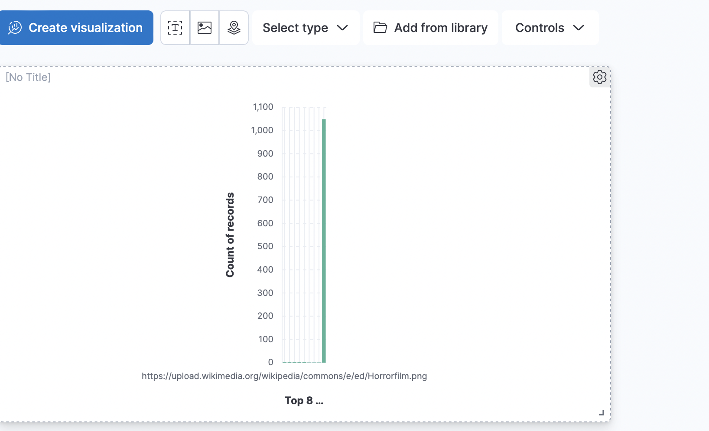

# Elasticsearch

# Etape d'installation Elasticsearch avec Docker : 
 téléchargement de l'image docker :

 - docker pull docker.elastic.co/elasticsearch/elasticsearch:8.7.1

Création d'un docker network pour elasticsearch et kibana :

 - docker network create elastic 

Démarrer Elasticsearch : 

- docker run --name elasticsearch --net elastic -p 9200:9200 -p 9300:9300 -e "discovery.type=single-node" -t docker.elastic.co/elasticsearch/elasticsearch:8.7.1
  
Installer l'image de Kibana et Démarrer le conteneur : 

- docker pull docker.elastic.co/kibana/kibana:8.7.1
- docker run --name kibana --net elastic -p 5601:5601 docker.elastic.co/kibana/kibana:8.7.1

Copie du certificat sur la machine locale (pas nécéssaire) : 

- docker cp <nomconteneur>:/usr/share/elasticsearch/config/certs/http_ca.crt .

Vérifier que la connection a elasticsearch est possible (pas nécéssaire) :

- curl --cacert http_ca.crt -u elastic https://localhost:9200

Une fois que tout les conteneurs sont en place on peut se rendre a l'adresse https://localhost:5061
ou il va falloir insérer le token kibana a trouver dans les logs du conteneur elasticsearch de meme pour le mot de passe utilisateur.

# source de donnée : 

Importer le fichier csv disponible dans 'assets/2020s-movies.csv' qui peut-être également télécharger à cette adresse : 
https://www.kaggle.com/datasets/exactful/wikipedia-movies
et créer une index "moviewiki" il est possible que les noms de colonnes ne soient pas les mêmes dans ce cas
il faut préciser "name", "image", "plot".

dans le repertoire demo se trouve l'application pour créer notre crud qui se lance sur le port localhost:8080
une fois le conteneur lancer il va falloir se rendre dans MainConfig.java et modifier private String password pour mettre le mot de passe génerer par le conteneur et faire de même pour String fingerprint.

dans le repertoire webapp se trouve l'application web pour rechercher des données provenant du crud

# Comment Elasticsearch procède-t-il au mapping ? 
    
    Elasticsearch peux mapper ses indexs de deux manière :
    - de manière dynamique : en analysant des documents pour créer de manière automatique les champs pour les documents
    - de manière prédéfini : se base sur une configuration pour tout définir

# Peut-on modifier le mapping sans recréer l’index ?

    Oui c'est possible exemple : 

    PUT /test-index/_mapping
    {
    "properties": {
        "field2": { "type": "text" }
        }
    }

# Tokenisation : 

    processus qui permet de découper une phrase en "tokens" chaque token représente un mot de la phrase.
    exemple : "Ceci est une phrase" le résultat sera ["Ceci","est","une","phrase"]

# Normalisation : 

    processus qui permet de passer un filtre sur les tokens.
    exemple : enlever les majuscules.

# Analyzer : 

    L'analyzer est utiliser à l'indexation d'un document, et est responsable de la transformation des données et division du texte en tokens en utilisant les processus de tokenisation et normalisation.
# TP3 

# Schéma fonctionnement Elasticsearch :

- Nous avont tout d'abord le cluster qui est un groupe de noeud.
- Chaque noeud possède des index (équivalent des tables en SQL).
- Les documents sont les données d'un index et sont stockés a l'intérieur.
- Les shards sont des fractions d'index, et se partagent les données d'un index dans l'exemple ci-dessus notre index se divise en deux shard et chaque shard possède donc 1/2 des données de l'index.
- Les alias permettent de "regrouper" des index sous un même nom pour facilité la recherche d'information.
- Les replica sont des copies de shard dans d'autre noeud, cela permet d'avoir une sauvegarde des données en cas de panne.

# Mise à l'échelle : 

Elasticsearch est conçu pour s'adapter aux changement de dimensions pour répondre aux besoins de stockage et de traitements de données par le biais de noeud et shard ou encore les replica.

## Kibana 

# Quel est l'usage principal de Kibana ? 

    Kibana est utilisé pour faire de la data-visualisation et va nous permettre de visualisé les données stockés dans elasticsearch

# Qu'est ce qu'un Dashboard ?

    c'est une interface visuelle et personnalisable qui présente les données d'elasticsearch en temps réel

    on peux créer plusieurs panneaux différents avec les données que l'on souhaite :

l'équivalent d'un schéma est IndexPattern c'est pour cela qu'aucune des propositions du qcm était juste.